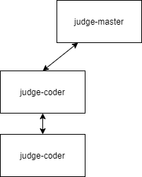

## 判题服务

### 需求

- 多类型题判题
- 多语言判程序
- 多判题机

### 功能

- [x] 获取题库
- [x] 添加题库
- [x] 删除题库
- [x] 更改题库
- [x] 判题
- [x] 判题机状态查询
- [x] 获取判题结果状态

### 错误码

```
enum Errcode {
  UNKNOWN = 3000, //未知错误
  TYPE = 3001, // 类型错误
  NO_FIND = 3002, //未找到题
  JUDGER_SERVER_ERR = 3003, //判题机错误
}
```

### Result判题结果码

```
0 正确
1 判题中
2 格式错误
3 答案错误
4 时间超限
5 内存超限
6 运行错误
7 编译错误
8 系统错误
9 队列中
-1 判题机错误
```

### 语言类型

```
c
cpp
java
py2
py3
```


### 设计



#### 组件

**judge-master**

负责对外提供 API、调度判题模块、并且内部实现单选题、多选题、填空题的判题

**judge-coder**

> 此模块是对青岛大学 OJ 的判题模块封装

负责对程序题进行判断

#### 请求头

X-USER => 用户ID

#### API

##### judge-master

###### 判程序题

POST `/api/v1/judger/code`

**请求**

```js
{
    "problemId": Number, //题ID
    "src": String, // 代码
    "lang": LangType, // 语言类型
    "isOutput":Boolean //是否输出
}
```

**响应**

```js
{
    "data": {
        "probleme_id": 6,
        "user_id": 1,
        "ip": "127.0.0.1",
        "type": "code",
        "data": {
            "src": "#include \"stdio.h\"\n\nint main(){\n  int a,b;\n  while(scanf(\"%d%d\", &a, &b)!=EOF){\n    printf(\"%d\", a+b);\n  }\n  return 0;\n}",
            "isOutput": true,
            "lang": "c"
        },
        "deleted_at": null,
        "id": 7,
        "is_disabled": false,
        "created_at": "2020-11-22T22:38:46.779Z",
        "updated_at": "2020-11-22T22:38:46.779Z",
        "game_id": 0,
        "game_problem_id": 0,
        "group_id": 0,
        "result": 0,
        "job_id": "7"
    },
    "errcode": 0
}
```

###### 判程序题（比赛）

POST `/api/v1/judger/game/code`

**请求**

```js
{
    "gameId": Number, // 比赛ID 0=不是比赛
    "gameProblemId": Number, //题ID
    "src": String, // 代码
    "lang": LangType, // 语言类型
    "groupId":Number, // 如果等于0表示不是组比赛
}
```

**响应**

```js
//同上
```

###### 判题

POST `/api/v1/judger/:type`

**请求**

- body

```js
{
    "problemId": Number, //题ID
     /*-- 用户输入的答案 --*/
    // single | fill
    "answer": String, 
    // multi
    "answers": [String]
}
/**
type:
    single => 单选
    multie => 多选
    fill => 填空
    code => 程序 看上面的·判程序题·
**/
```

**响应**

```js
{
    "data": {
        "probleme_id": 6,
        "user_id": 1,
        "ip": "127.0.0.1",
        "type": "code",
        "data": {
            "src": "#include \"stdio.h\"\n\nint main(){\n  int a,b;\n  while(scanf(\"%d%d\", &a, &b)!=EOF){\n    printf(\"%d\", a+b);\n  }\n  return 0;\n}",
            "isOutput": true,
            "lang": "c"
        },
        "deleted_at": null,
        "id": 7,
        "is_disabled": false,
        "created_at": "2020-11-22T22:38:46.779Z",
        "updated_at": "2020-11-22T22:38:46.779Z",
        "game_id": 0,
        "game_problem_id": 0,
        "group_id": 0,
        "result": 0,
        "job_id": "7"
    },
    "errcode": 0
}
```

###### 判题（比赛）

POST `/api/v1/judger/game/:type`

**请求**

- body

```js
{
    "gameId": Number, // 比赛ID 0=不是比赛
    "gameProblemId": Number, //题ID
    "answer": String, // 答案 single=选项 multi=选项1,选项2 fill=填
    "groupId":Number, // 如果等于0表示不是组比赛
}
/**
type:
    single => 单选
    multie => 多选
    fill => 填空
**/
```

**响应**

```js
// 同上
```

###### 获取题库

GET `/api/v1/problem/:problemId`

**请求**

- :problemId

```
[1, +) => 表示题目的ID
```

**响应**

```js
//code
{
    "data": {
        "title": "A+B",
        "description": "测试题",
        "is_disabled": false,
        "hint": "测试题目",
        "source": "LH",
        "tags": [
            "算法",
            "数据结构"
        ],
        "hard": 10,
        "data": {
            "input": "输入两个数",
            "output": "输出他的结果",
            "sample_input": "1 2",
            "sample_output": "3\n",
            "time_limit": 1000,
            "memory_limit": 134217728,
            "src": "#include \"stdio.h\"\n\nint main(){\n  int a,b;\n  while(scanf(\"%d%d\", &a, &b)!=EOF){\n    printf(\"%d\\n\", a+b);\n  }\n  return 0;\n}"
        },
        "type": "code",
        "create_user_id": 0,
        "deleted_at": null,
        "id": 7,
        "created_at": "2020-11-23T05:35:06.212Z",
        "updated_at": "2020-11-23T05:35:06.212Z",
        "ac_num": 0,
        "submit_num": 0
    },
    "errcode": 0
}

//single
{
    "data": {
        "title": "测试题7",
        "description": "hello",
        "is_disabled": false,
        "hint": "测试题目",
        "source": "LH",
        "tags": [
            "算法",
            "数据结构"
        ],
        "hard": 10,
        "data": {
            "answer": "选项B",
            "options": [
                "选项A",
                "选项B",
                "选项C"
            ]
        },
        "type": "single",
        "create_user_id": 0,
        "deleted_at": null,
        "id": 8,
        "created_at": "2020-11-23T05:54:15.990Z",
        "updated_at": "2020-11-23T05:54:15.990Z",
        "ac_num": 0,
        "submit_num": 0
    },
    "errcode": 0
}

//multi
{
    "data": {
        "title": "测试题7",
        "description": "hello",
        "is_disabled": false,
        "hint": "测试题目",
        "source": "LH",
        "tags": [
            "算法",
            "数据结构"
        ],
        "hard": 10,
        "data": {
            "answers": [
                "选项B",
                "选项C"
            ],
            "options": [
                "选项A",
                "选项B",
                "选项C"
            ]
        },
        "type": "multi",
        "create_user_id": 0,
        "deleted_at": null,
        "id": 9,
        "created_at": "2020-11-23T06:23:01.644Z",
        "updated_at": "2020-11-23T06:23:01.644Z",
        "ac_num": 0,
        "submit_num": 0
    },
    "errcode": 0
}

//fill
{
    "data": {
        "title": "测试题7",
        "description": "hello",
        "is_disabled": false,
        "hint": "测试题目",
        "source": "LH",
        "tags": [
            "算法",
            "数据结构"
        ],
        "hard": 10,
        "data": {
            "keywords": [
                "允许的关键字",
                "允许的关键字",
                "允许的关键字"
            ],
            "nokeywords": [
                "不允许的关键字",
                "不允许的关键字"
            ]
        },
        "type": "fill",
        "create_user_id": 0,
        "deleted_at": null,
        "id": 11,
        "created_at": "2020-11-23T06:25:03.967Z",
        "updated_at": "2020-11-23T06:25:03.967Z",
        "ac_num": 0,
        "submit_num": 0
    },
    "errcode": 0
}
```

###### 获取题库（群查）

GET `/api/v1/problem`

**请求**

- Params

```
// 通用分页, 请看主文档
```

**响应**

```js
{
    "data": [
        {
            "id": 4,
            "is_disabled": false,
            "created_at": "2020-11-24T18:27:38.037Z",
            "updated_at": "2020-11-24T18:27:38.037Z",
            "deleted_at": null,
            "title": "A+B",
            "description": "测试题",
            "hint": "测试题目",
            "source": "LH",
            "tags": [
                "算法",
                "数据结构"
            ],
            "ac_num": 0,
            "submit_num": 0,
            "hard": 10,
            "create_user_id": 0,
            "type": "code",
            "data": {
                "input": "输入两个数",
                "output": "输出他的结果",
                "sample_input": "1 2",
                "sample_output": "3\n",
                "time_limit": 1000,
                "memory_limit": 134217728,
                "src": null
            }
        },
        {
            "id": 3,
            "is_disabled": false,
            "created_at": "2020-11-24T18:26:39.769Z",
            "updated_at": "2020-11-24T18:26:39.769Z",
            "deleted_at": null,
            "title": "测试题3",
            "description": "hello",
            "hint": "测试题目",
            "source": "LH",
            "tags": [
                "算法",
                "数据结构"
            ],
            "ac_num": 0,
            "submit_num": 0,
            "hard": 10,
            "create_user_id": 0,
            "type": "single",
            "data": {
                "answer": null,
                "options": [
                    "选项A",
                    "选项B",
                    "选项C"
                ]
            }
        },
        {
            "id": 2,
            "is_disabled": false,
            "created_at": "2020-11-24T18:25:36.411Z",
            "updated_at": "2020-11-24T18:25:36.411Z",
            "deleted_at": null,
            "title": "测试题2",
            "description": "hello",
            "hint": "测试题目",
            "source": "LH",
            "tags": [
                "算法",
                "数据结构"
            ],
            "ac_num": 0,
            "submit_num": 0,
            "hard": 10,
            "create_user_id": 0,
            "type": "multi",
            "data": {
                "answers": null,
                "options": [
                    "选项A",
                    "选项B",
                    "选项C"
                ]
            }
        },
        {
            "id": 1,
            "is_disabled": false,
            "created_at": "2020-11-24T18:21:12.640Z",
            "updated_at": "2020-11-24T18:21:12.640Z",
            "deleted_at": null,
            "title": "测试题1",
            "description": "hello",
            "hint": "测试题目",
            "source": "LH",
            "tags": [
                "算法",
                "数据结构"
            ],
            "ac_num": 0,
            "submit_num": 0,
            "hard": 10,
            "create_user_id": 0,
            "type": "fill",
            "data": {
                "keywords": null,
                "nokeywords": null
            }
        }
    ],
    "errcode": 0,
    "page": {
        "num": 1,
        "size": 30,
        "total": 4
    }
}
```

###### 添加题库

POST `/api/v1/problem/:type`

**请求**

- :type

```
code => 程序
single => 单选题
multi => 多选题
fill => 填空题
```

- Body

```js
//code
{
    "is_disabled":false,
    "title":"A+B",
    "description":"测试题",
    "hint":"测试题目",
    "tags":["算法", "数据结构"],
    "source":"LH",
    "hard":10,
    "input": "输入两个数",
    "output": "输出他的结果",
    "sample_input": "1 2",
    "sample_output": "3\n",
    "time_limit": 1000,
    "memory_limit": 134217728,
    "src": "#include \"stdio.h\"\n\nint main(){\n  int a,b;\n  while(scanf(\"%d%d\", &a, &b)!=EOF){\n    printf(\"%d\\n\", a+b);\n  }\n  return 0;\n}"
}

//single
{
    "is_disabled":false,
    "title":"测试题7",
    "description":"hello",
    "hint":"测试题目",
    "tags":["算法", "数据结构"],
    "source":"LH",
    "hard":10,
    "options":["选项A", "选项B", "选项C"],
    "answer": "选项B"
}

//multi
{
    "is_disabled":false,
    "title":"测试题7",
    "description":"hello",
    "hint":"测试题目",
    "tags":["算法", "数据结构"],
    "source":"LH",
    "hard":10,
    "options":["选项A", "选项B", "选项C"],
    "answers": ["选项B", "选项C"]
}

//fill
{
    "is_disabled":false,
    "title":"测试题7",
    "description":"hello",
    "hint":"测试题目",
    "tags":["算法", "数据结构"],
    "source":"LH",
    "hard":10,
    "keywords":["允许的关键字", "允许的关键字", "允许的关键字"],
    "nokeywords": ["不允许的关键字", "不允许的关键字"]
}
```

**响应**

```js
//code
{
    "data": {
        "title": "A+B",
        "description": "测试题",
        "is_disabled": false,
        "hint": "测试题目",
        "source": "LH",
        "tags": [
            "算法",
            "数据结构"
        ],
        "hard": 10,
        "data": {
            "input": "输入两个数",
            "output": "输出他的结果",
            "sample_input": "1 2",
            "sample_output": "3\n",
            "time_limit": 1000,
            "memory_limit": 134217728,
        },
        "type": "code",
        "create_user_id": 0,
        "deleted_at": null,
        "id": 7,
        "created_at": "2020-11-23T05:35:06.212Z",
        "updated_at": "2020-11-23T05:35:06.212Z",
        "ac_num": 0,
        "submit_num": 0
    },
    "errcode": 0
}

//single
{
    "data": {
        "title": "测试题7",
        "description": "hello",
        "is_disabled": false,
        "hint": "测试题目",
        "source": "LH",
        "tags": [
            "算法",
            "数据结构"
        ],
        "hard": 10,
        "data": {
            "options": [
                "选项A",
                "选项B",
                "选项C"
            ]
        },
        "type": "single",
        "create_user_id": 0,
        "deleted_at": null,
        "id": 8,
        "created_at": "2020-11-23T05:54:15.990Z",
        "updated_at": "2020-11-23T05:54:15.990Z",
        "ac_num": 0,
        "submit_num": 0
    },
    "errcode": 0
}

//multi
{
    "data": {
        "title": "测试题7",
        "description": "hello",
        "is_disabled": false,
        "hint": "测试题目",
        "source": "LH",
        "tags": [
            "算法",
            "数据结构"
        ],
        "hard": 10,
        "data": {
            "options": [
                "选项A",
                "选项B",
                "选项C"
            ]
        },
        "type": "multi",
        "create_user_id": 0,
        "deleted_at": null,
        "id": 9,
        "created_at": "2020-11-23T06:23:01.644Z",
        "updated_at": "2020-11-23T06:23:01.644Z",
        "ac_num": 0,
        "submit_num": 0
    },
    "errcode": 0
}

//fill
{
    "data": {
        "title": "测试题7",
        "description": "hello",
        "is_disabled": false,
        "hint": "测试题目",
        "source": "LH",
        "tags": [
            "算法",
            "数据结构"
        ],
        "hard": 10,
        "data": {
            "keywords": [
                "允许的关键字",
                "允许的关键字",
                "允许的关键字"
            ],
            "nokeywords": [
                "不允许的关键字",
                "不允许的关键字"
            ]
        },
        "type": "fill",
        "create_user_id": 0,
        "deleted_at": null,
        "id": 11,
        "created_at": "2020-11-23T06:25:03.967Z",
        "updated_at": "2020-11-23T06:25:03.967Z",
        "ac_num": 0,
        "submit_num": 0
    },
    "errcode": 0
}
```

###### 删除题库

DELETE `/api/v1/problem/:problemId`

**请求**

- :problemId

```
[1, +) => 表示用户的ID
```

**响应**

```
{
	...
}
```


###### 修改题库

PUT `/api/v1/problem/:type/:problemID`

**Type**

code | single | multi | fill

**请求**

- Body

```js
{
	is_disabled:Number,
    title:String,
    description:String,
    hint:String, // 提示
    source:String, //来源
    tags:[String], // 标签 如: 算法,数据结构
    hard:Number, //难度
    //type == code
    input:String,//输入说明
	output:String,//输出说明
	sample_input:String,//输入参照
	sample_output:String,//输出参照
    time_limit:Number,//限制时间（毫秒）
	memory_limit:Number,//空间限制（字节）
    src:String//程序源码 

    //type == single
    options:[String],
    answer:String,
    
    //type == multi
    options:[String],
    answers:[String],
    
    //type == fill
    keywords:["关键字1","关键字2"],//答案里出现的关键字,JSON串
    nokeywords:["关键字1","关键字2"],//答案里不能出现的关键字,JSON串
}
```

> TIP: 可以单独修改某个字段

**响应**

```js
{
    ...,
    data:{
        id:Number,
        is_disabled:Number,
        created_at:Date,
        updated_at:Date,
        type:String,
        title:String,
        description:String,
        hint:String, // 提示
        source:String, //来源
        tags:[String], // 标签 如: 算法,数据结构
        hard:Number, //难度
        accepted:Number, //AC人数
        submit:Number, //提交人数
        //code
        input:String,//输入说明
        output:String,//输出说明
        sample_input:String,//输入参照
        sample_output:String,//输出参照
        spj:String,//是否为特别题目
        time_limit:Number,//限制时间（毫秒）
        memory_limit:Number,//空间限制（兆字节）
        
        options:[String],
    }
}
```

###### 获取判题机状态

GET `/api/v1/judger`

**请求**

NULL

**响应**

```js
{
    ...,
    data:[
        {
            judgerId: String, //机器ID
            cpu: String, //CPU占用
            memory: String, // 内存占用
            rebootNum:Number, // 重启次数
            execNum:Number, //处理的任务数
        	awaitNum:Number, //等待的任务数
            completeNum:Number, //完成数
        }
    ]
}
```

###### 获取判题结果状态

GET `/api/v1/judger/solution[:/ID]`

**请求**

- Params

```
// 通用分页, 请看主文档
```

**响应**

```js
{
    "data": [
        {
            "id": 1,
            "is_disabled": false,
            "created_at": "2020-11-24T18:29:35.320Z",
            "updated_at": "2020-11-24T18:29:35.000Z",
            "deleted_at": null,
            "game_id": 0,
            "game_problem_id": 0,
            "probleme_id": 4,
            "user_id": 1,
            "group_id": 0,
            "ip": "127.0.0.1",
            "result": 0,
            "job_id": "9",
            "type": "code",
            "data": {
                "src": "#include \"stdio.h\"\n\nint main(){\n  int a,b;\n  while(scanf(\"%d%d\", &a, &b)!=EOF){\n    printf(\"%d\", a+b);\n  }\n  return 0;\n}",
                "isOutput": true,
                "lang": "c",
                "output": null,
                "time": 13,
                "memory": 1626112
            }
        },
        {
            "id": 2,
            "is_disabled": false,
            "created_at": "2020-11-24T18:30:40.475Z",
            "updated_at": "2020-11-24T18:30:40.000Z",
            "deleted_at": null,
            "game_id": 0,
            "game_problem_id": 0,
            "probleme_id": 4,
            "user_id": 1,
            "group_id": 0,
            "ip": "127.0.0.1",
            "result": -1,
            "job_id": "0",
            "type": "code",
            "data": {
                "src": "#include \"stdio.h\"\n\nint main(){\n  int a,b;\n  while(scanf(\"%d%d\", &a, &b)!=EOF){\n    printf(\"%d\", a+b);\n  }\n  return 0;\n}",
                "isOutput": true,
                "lang": "c"
            }
        }
    ],
    "errcode": 0,
    "page": {
        "num": 1,
        "size": 30,
        "total": 2
    }
}
// 单查
{
    "data": {
        "id": 1,
        "is_disabled": false,
        "created_at": "2020-11-24T18:29:35.320Z",
        "updated_at": "2020-11-24T18:29:35.000Z",
        "deleted_at": null,
        "game_id": 0,
        "game_problem_id": 0,
        "probleme_id": 4,
        "user_id": 1,
        "group_id": 0,
        "ip": "127.0.0.1",
        "result": 0,
        "job_id": "9",
        "type": "code",
        "data": {
            "src": "#include \"stdio.h\"\n\nint main(){\n  int a,b;\n  while(scanf(\"%d%d\", &a, &b)!=EOF){\n    printf(\"%d\", a+b);\n  }\n  return 0;\n}",
            "isOutput": true,
            "lang": "c",
            "output": null,
            "time": 13,
            "memory": 1626112
        }
    },
    "errcode": 0
}
```

###### ~~获取比赛判题结果状态~~

GET `/api/v1/game/solution[/:ID]`

**请求**

- Params

```
// 通用分页, 请看主文档
```

**响应**

```js
{
    ...,
    data:[
        {
            id:Number,
            user_id:Number,
            problem_id:Number,
            judger:Number,
            ip:Number,
            result:Number, //查看上面的状态
            time:Number,
            memory:Number,
            lang:String,
            code_length:Number,
        }
    ]
}
```

###### 获取所有任务

GET /api/v1/judger/job[/:id]

**请求**

- Params

```
// 通用分页, 请看主文档
```


**响应**

```js
{
    "data": [
        {
            "id": "9",
            "name": "code",
            "data": {
                "problemId": 4,
                "solutionId": 1
            },
            "opts": {
                "attempts": 1,
                "delay": 0,
                "timestamp": 1606271375083
            },
            "progress": 100,
            "delay": 0,
            "timestamp": 1606271375083,
            "attemptsMade": 0,
            "stacktrace": [],
            "returnvalue": {
                "id": 1,
                "is_disabled": false,
                "created_at": "2020-11-24T18:29:35.320Z",
                "updated_at": "2020-11-24T18:29:35.000Z",
                "deleted_at": null,
                "game_id": 0,
                "game_problem_id": 0,
                "probleme_id": 4,
                "user_id": 1,
                "group_id": 0,
                "ip": "127.0.0.1",
                "result": 0,
                "job_id": "9",
                "type": "code",
                "data": {
                    "src": "#include \"stdio.h\"\n\nint main(){\n  int a,b;\n  while(scanf(\"%d%d\", &a, &b)!=EOF){\n    printf(\"%d\", a+b);\n  }\n  return 0;\n}",
                    "isOutput": true,
                    "lang": "c",
                    "output": null,
                    "time": 13,
                    "memory": 1626112
                }
            },
            "finishedOn": 1606271375670,
            "processedOn": 1606271375086
        },
        {
            "id": "8",
            "name": "code",
            "data": {
                "problemId": 6,
                "solutionId": 8
            },
            "opts": {
                "attempts": 1,
                "delay": 0,
                "timestamp": 1606269694235
            },
            "progress": 100,
            "delay": 0,
            "timestamp": 1606269694235,
            "attemptsMade": 0,
            "stacktrace": [],
            "returnvalue": {
                "id": 8,
                "is_disabled": false,
                "created_at": "2020-11-24T18:01:34.464Z",
                "updated_at": "2020-11-24T18:01:34.000Z",
                "deleted_at": null,
                "game_id": 0,
                "game_problem_id": 0,
                "probleme_id": 6,
                "user_id": 1,
                "group_id": 0,
                "ip": "127.0.0.1",
                "result": 7,
                "job_id": "8",
                "type": "code",
                "data": {
                    "src": "#include \"stdio.h\"\n\nint main(){\n  int a,b;\n  while(scanf(\"%d%d\", &a, &b)!=EOF){\n    printf(\"%d\", a+b);\n  }\n  return 0;\n}",
                    "isOutput": true,
                    "lang": "c"
                }
            },
            "finishedOn": 1606269694339,
            "processedOn": 1606269694245
        },
        {
            "id": "7",
            "name": "code",
            "data": {
                "problemId": 6,
                "solutionId": 7
            },
            "opts": {
                "attempts": 1,
                "delay": 0,
                "timestamp": 1606113526789
            },
            "progress": 0,
            "delay": 0,
            "timestamp": 1606113526789,
            "attemptsMade": 0,
            "stacktrace": [],
            "returnvalue": {
                "id": 7,
                "is_disabled": false,
                "created_at": "2020-11-22T22:38:46.779Z",
                "updated_at": "2020-11-22T22:38:47.000Z",
                "deleted_at": null,
                "game_id": 0,
                "game_problem_id": 0,
                "probleme_id": 6,
                "user_id": 1,
                "group_id": 0,
                "ip": "127.0.0.1",
                "result": 0,
                "job_id": "7",
                "type": "code",
                "data": {
                    "src": "#include \"stdio.h\"\n\nint main(){\n  int a,b;\n  while(scanf(\"%d%d\", &a, &b)!=EOF){\n    printf(\"%d\", a+b);\n  }\n  return 0;\n}",
                    "isOutput": true,
                    "lang": "c",
                    "output": "3",
                    "time": 10,
                    "memory": 1679360
                }
            },
            "finishedOn": 1606113527393,
            "processedOn": 1606113526793
        },
        {
            "id": "6",
            "name": "code",
            "data": {
                "problemId": 6,
                "solutionId": 6
            },
            "opts": {
                "attempts": 1,
                "delay": 0,
                "timestamp": 1606113411794
            },
            "progress": 0,
            "delay": 0,
            "timestamp": 1606113411794,
            "attemptsMade": 0,
            "stacktrace": [],
            "returnvalue": {
                "id": 6,
                "is_disabled": false,
                "created_at": "2020-11-22T22:36:51.783Z",
                "updated_at": "2020-11-22T22:36:56.000Z",
                "deleted_at": null,
                "game_id": 0,
                "game_problem_id": 0,
                "probleme_id": 6,
                "user_id": 1,
                "group_id": 0,
                "ip": "127.0.0.1",
                "result": 4,
                "job_id": "6",
                "type": "code",
                "data": {
                    "src": "#include \"stdio.h\"\n\nint main(){\n  int a,b;\n  while(scanf(\"%d%d\", &a, &b)){\n    printf(\"%d\\n\", a+b);\n  }\n  return 0;\n}",
                    "isOutput": true,
                    "lang": "c",
                    "output": "",
                    "time": 4010,
                    "memory": 1601536
                }
            },
            "finishedOn": 1606113416468,
            "processedOn": 1606113411797
        },
        {
            "id": "5",
            "name": "code",
            "data": {
                "problemId": 6,
                "solutionId": 5
            },
            "opts": {
                "attempts": 1,
                "delay": 0,
                "timestamp": 1606113334880
            },
            "progress": 0,
            "delay": 0,
            "timestamp": 1606113334880,
            "attemptsMade": 0,
            "stacktrace": [],
            "returnvalue": {
                "id": 5,
                "is_disabled": false,
                "created_at": "2020-11-22T22:35:34.869Z",
                "updated_at": "2020-11-22T22:35:35.000Z",
                "deleted_at": null,
                "game_id": 0,
                "game_problem_id": 0,
                "probleme_id": 6,
                "user_id": 1,
                "group_id": 0,
                "ip": "127.0.0.1",
                "result": 3,
                "job_id": "5",
                "type": "code",
                "data": {
                    "src": "#include \"stdio.h\"\n\nint main(){\n  int a,b;\n  while(scanf(\"%d%d\", &a, &b)!=EOF){\n    printf(\" %d\\n\", a+b);\n  }\n  return 0;\n}",
                    "isOutput": true,
                    "lang": "c",
                    "output": " 3\n",
                    "time": 12,
                    "memory": 1630208
                }
            },
            "finishedOn": 1606113335264,
            "processedOn": 1606113334883
        },
        {
            "id": "4",
            "name": "code",
            "data": {
                "problemId": 6,
                "solutionId": 4
            },
            "opts": {
                "attempts": 1,
                "delay": 0,
                "timestamp": 1606113308295
            },
            "progress": 0,
            "delay": 0,
            "timestamp": 1606113308295,
            "attemptsMade": 0,
            "stacktrace": [],
            "returnvalue": {
                "id": 4,
                "is_disabled": false,
                "created_at": "2020-11-22T22:35:08.283Z",
                "updated_at": "2020-11-22T22:35:08.000Z",
                "deleted_at": null,
                "game_id": 0,
                "game_problem_id": 0,
                "probleme_id": 6,
                "user_id": 1,
                "group_id": 0,
                "ip": "127.0.0.1",
                "result": 7,
                "job_id": "4",
                "type": "code",
                "data": {
                    "src": "#include \"stdio.h\"\n\nint main(){\n  int a,b;\n  while(scanf(\"%d%d\", &a, &b)!=EOF){\n    printf(%d\\n\", a+b);\n  }\n  return 0;\n}",
                    "isOutput": true,
                    "lang": "c"
                }
            },
            "finishedOn": 1606113308529,
            "processedOn": 1606113308302
        },
        {
            "id": "10",
            "name": "code",
            "data": {
                "problemId": 4,
                "solutionId": 2
            },
            "opts": {
                "attempts": 1,
                "delay": 0,
                "timestamp": 1606271440237
            },
            "progress": 20,
            "delay": 0,
            "timestamp": 1606271440237,
            "attemptsMade": 1,
            "failedReason": "judge coder err",
            "stacktrace": [
                "Error: judge coder err\n    at JudgerConsumer.judgeCode (e:\\workspaces\\learning-hub\\learning-hub-service-judger\\src\\judge-master\\dist\\modules\\judger\\judger.consumer.js:42:19)\n    at processTicksAndRejections (internal/process/task_queues.js:93:5)"
            ],
            "returnvalue": null,
            "finishedOn": 1606271440305,
            "processedOn": 1606271440239
        },
        {
            "id": "3",
            "name": "code",
            "data": {
                "problemId": 6,
                "solutionId": 3
            },
            "opts": {
                "attempts": 1,
                "delay": 0,
                "timestamp": 1606112811617
            },
            "progress": 0,
            "delay": 0,
            "timestamp": 1606112811617,
            "attemptsMade": 1,
            "failedReason": "CompileError",
            "stacktrace": [
                "Error: CompileError\n    at JudgerConsumer.judgeCode (E:\\workspaces\\learning-hub\\learning-hub-service-judger\\src\\judge-master\\dist\\modules\\judger\\judger.consumer.js:49:19)\n    at processTicksAndRejections (internal/process/task_queues.js:93:5)"
            ],
            "returnvalue": null,
            "finishedOn": 1606112811984,
            "processedOn": 1606112811622
        },
        {
            "id": "2",
            "name": "code",
            "data": {
                "problemId": 6,
                "solutionId": 2
            },
            "opts": {
                "attempts": 1,
                "delay": 0,
                "timestamp": 1606105201392
            },
            "progress": 0,
            "delay": 0,
            "timestamp": 1606105201392,
            "attemptsMade": 1,
            "failedReason": "WARN_DATA_TRUNCATED: Data truncated for column 'result' at row 1",
            "stacktrace": [
                "QueryFailedError: WARN_DATA_TRUNCATED: Data truncated for column 'result' at row 1\n    at new QueryFailedError (E:\\workspaces\\learning-hub\\learning-hub-service-judger\\src\\judge-master\\node_modules\\typeorm\\error\\QueryFailedError.js:11:28)\n    at Query.<anonymous> (E:\\workspaces\\learning-hub\\learning-hub-service-judger\\src\\judge-master\\node_modules\\typeorm\\driver\\mysql\\MysqlQueryRunner.js:216:45)\n    at Query.<anonymous> (E:\\workspaces\\learning-hub\\learning-hub-service-judger\\src\\judge-master\\node_modules\\mysql\\lib\\Connection.js:526:10)\n    at Query._callback (E:\\workspaces\\learning-hub\\learning-hub-service-judger\\src\\judge-master\\node_modules\\mysql\\lib\\Connection.js:488:16)\n    at Query.Sequence.end (E:\\workspaces\\learning-hub\\learning-hub-service-judger\\src\\judge-master\\node_modules\\mysql\\lib\\protocol\\sequences\\Sequence.js:83:24)\n    at Query.ErrorPacket (E:\\workspaces\\learning-hub\\learning-hub-service-judger\\src\\judge-master\\node_modules\\mysql\\lib\\protocol\\sequences\\Query.js:92:8)\n    at Protocol._parsePacket (E:\\workspaces\\learning-hub\\learning-hub-service-judger\\src\\judge-master\\node_modules\\mysql\\lib\\protocol\\Protocol.js:291:23)\n    at Parser._parsePacket (E:\\workspaces\\learning-hub\\learning-hub-service-judger\\src\\judge-master\\node_modules\\mysql\\lib\\protocol\\Parser.js:433:10)\n    at Parser.write (E:\\workspaces\\learning-hub\\learning-hub-service-judger\\src\\judge-master\\node_modules\\mysql\\lib\\protocol\\Parser.js:43:10)\n    at Protocol.write (E:\\workspaces\\learning-hub\\learning-hub-service-judger\\src\\judge-master\\node_modules\\mysql\\lib\\protocol\\Protocol.js:38:16)"
            ],
            "returnvalue": null,
            "finishedOn": 1606105201813,
            "processedOn": 1606105201400
        },
        {
            "id": "1",
            "name": "code",
            "data": {
                "problemId": 6,
                "solutionId": 1
            },
            "opts": {
                "attempts": 1,
                "delay": 0,
                "timestamp": 1606105012430
            },
            "progress": 0,
            "delay": 0,
            "timestamp": 1606105012430,
            "attemptsMade": 1,
            "failedReason": "WARN_DATA_TRUNCATED: Data truncated for column 'result' at row 1",
            "stacktrace": [
                "QueryFailedError: WARN_DATA_TRUNCATED: Data truncated for column 'result' at row 1\n    at new QueryFailedError (E:\\workspaces\\learning-hub\\learning-hub-service-judger\\src\\judge-master\\node_modules\\typeorm\\error\\QueryFailedError.js:11:28)\n    at Query.<anonymous> (E:\\workspaces\\learning-hub\\learning-hub-service-judger\\src\\judge-master\\node_modules\\typeorm\\driver\\mysql\\MysqlQueryRunner.js:216:45)\n    at Query.<anonymous> (E:\\workspaces\\learning-hub\\learning-hub-service-judger\\src\\judge-master\\node_modules\\mysql\\lib\\Connection.js:526:10)\n    at Query._callback (E:\\workspaces\\learning-hub\\learning-hub-service-judger\\src\\judge-master\\node_modules\\mysql\\lib\\Connection.js:488:16)\n    at Query.Sequence.end (E:\\workspaces\\learning-hub\\learning-hub-service-judger\\src\\judge-master\\node_modules\\mysql\\lib\\protocol\\sequences\\Sequence.js:83:24)\n    at Query.ErrorPacket (E:\\workspaces\\learning-hub\\learning-hub-service-judger\\src\\judge-master\\node_modules\\mysql\\lib\\protocol\\sequences\\Query.js:92:8)\n    at Protocol._parsePacket (E:\\workspaces\\learning-hub\\learning-hub-service-judger\\src\\judge-master\\node_modules\\mysql\\lib\\protocol\\Protocol.js:291:23)\n    at Parser._parsePacket (E:\\workspaces\\learning-hub\\learning-hub-service-judger\\src\\judge-master\\node_modules\\mysql\\lib\\protocol\\Parser.js:433:10)\n    at Parser.write (E:\\workspaces\\learning-hub\\learning-hub-service-judger\\src\\judge-master\\node_modules\\mysql\\lib\\protocol\\Parser.js:43:10)\n    at Protocol.write (E:\\workspaces\\learning-hub\\learning-hub-service-judger\\src\\judge-master\\node_modules\\mysql\\lib\\protocol\\Protocol.js:38:16)"
            ],
            "returnvalue": null,
            "finishedOn": 1606105012984,
            "processedOn": 1606105012432
        }
    ],
    "errcode": 0,
    "page": {
        "num": 1,
        "size": 30,
        "total": 10
    }
}
```

###### 获取所有API

GET /api/v1

**请求**

```js
null
```

**响应**

```
{
	errcode:0,
	data:[
		{
			protocol: String, //协议
			type: String, //类型
			router: String, //路由
		}
	]
}
```


##### judge-coder

> 请参考青岛大学OJ https://docs.onlinejudge.me/#/judgeserver/api

###### 获取系统信息

GET `/ping`

**请求**

Null

**响应**

```js
{
    "judger_version": "2.0.1",
    "hostname": "d3765528134e", //同时也是ID
    // number of cpu cores, this value will determine the number of concurrent tasks
    "cpu_core": 1,
    // usage of cpu and memory
    "cpu": 4.1,
    "memory": 24.5,
    "action": "pong"
}
```

###### 判题

POST` /judge`

**请求**

- `src`: source code
- `language_config`: refer to `client/Python/languages.py`, do not need to modify generally
- `max_cpu_time`: unit is ms
- `max_memory`: unit is byte
- `test_case_id`: used to get the test_case directory
- `output`: if this value is `true`, then user's output is returned else `null` is returned. You can use this to debug your solution

```js
{
    src: String, //源代码
    language_config: Object, //语言配置
    max_cpu_time: Number, //限制时间
    max_memory: Number, //限制内存
    test_case_id: String, //测试实例ID
    output: Boolean, //是否输出打印
}
```


**响应**

```js
[
    // each object/dict is a test case file running result
    {
        "cpu_time": 1,
        // refer to the end of this document
        "result": 0,
        "memory": 12836864,
        "real_time": 2,
        "signal": 0,
        "error": 0,
        // refer to the end of this document
        "exit_code": 0,
        "output_md5": "eccbc87e4b5ce2fe28308fd9f2a7baf3",
        // test case file id
        "test_case": 1
    },
    {
        "cpu_time": 1,
        "result": 0,
        "memory": 12849152,
        "real_time": 1,
        "signal": 0,
        "error": 0,
        "exit_code": 0,
        "output_md5": "eccbc87e4b5ce2fe28308fd9f2a7baf3",
        "test_case": 2
    }
]
```

When compilation is failed, following data will be returned

```js
{
    "err": "CompileError", 
    "data": "error resson"
}
```

错误码

```
If SPJ process crashed, result = SYSTEM_ERROR and ERROR = SPJ_ERROR is returned.

result field return value
WRONG_ANSWER = -1 (this means the process exited normally, but the answer is wrong)
SUCCESS = 0 (this means the answer is accepted)
CPU_TIME_LIMIT_EXCEEDED = 1
REAL_TIME_LIMIT_EXCEEDED = 2
MEMORY_LIMIT_EXCEEDED = 3
RUNTIME_ERROR = 4
SYSTEM_ERROR = 5

error field return value
SUCCESS = 0
INVALID_CONFIG = -1
CLONE_FAILED = -2
PTHREAD_FAILED = -3
WAIT_FAILED = -4
ROOT_REQUIRED = -5
LOAD_SECCOMP_FAILED = -6
SETRLIMIT_FAILED = -7
DUP2_FAILED = -8
SETUID_FAILED = -9
EXECVE_FAILED = -10
SPJ_ERROR = -11
```


