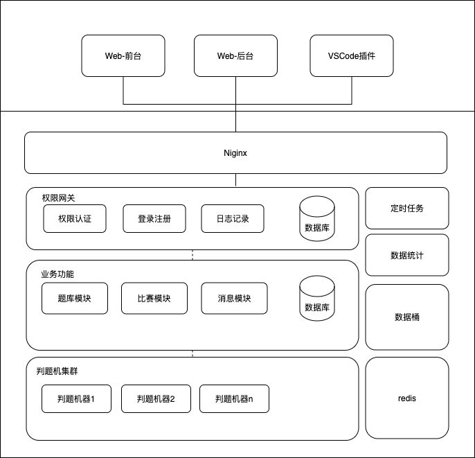

# learning-hub 第三版设计

## 系统设计

> 服务内部之间使用消息队列通信。外部使用HTTP通信。

### Nginx

负责静态网站的部署和路由分发。

### 权限网关

负责对用户的管理、用户角色的管理、角色权限的管理、角色权限的判断等，并且记录日志统计数据。

### 业务功能

#### 题库模块

负责题库的管理，并且与远程Git仓库实时同步。

负责调用判题机判题。

题库模型

- /problems								# 题库
  - 1000/								 # 题号
    - desc.md					 # 描述文件
    - source.c			         # 源码	
    - template                    # 输入用例模板
    - testcase/                    # 测试用例
      - 1.in
      - 1.out
      - 2.in
      - 2.out

#### 比赛模块

负责

## 数据模型

## APIv1接口

## 核心功能设计

## 系统部署
