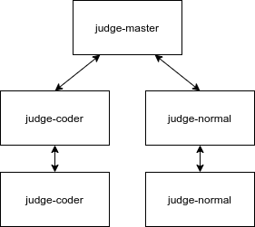

## 判题服务

### 需求

- 多类型题判题
- 多语言判程序
- 多判题机

### 功能

- [x] 获取题库
- [x] 添加题库
- [x] 删除题库
- [x] 更改题库
- [x] 判题
- [x] 判题机状态查询
- [x] 获取判题结果状态

### 错误码

```
3000 未知错误
3001 无判题机
3002 数据库错误
```

### Result判题结果码

```
0 正确
1 判题中
2 格式错误
3 答案错误
4 时间超限
5 内存超限
6 运行错误
7 编译错误
```

### 语言类型

```
c
cpp
java
py2
py3
```


### 设计



#### 组件

**judge-master**

负责对外提供 API、调度判题模块

**judge-coder**

> 此模块是对青岛大学 OJ 的判题模块封装

负责对程序题进行判断

**judge-normal**

负责对普通（单选、多选、填空、问答）的题型判断

#### API

##### judge-master

###### 判程序题

POST `/api/v1/judger/code`

**请求**

```js
{
    "problemId": Number, //题ID
    "src": String, // 代码
    "lang": LangType, // 语言类型
}
```

**响应**

```js
{
    ...,
    data:{
    	testcases:[
            {
                cpu_time: 12760, // ms
                error: 0, // look down
                exit_code: 0,
                memory: 1617920, // B
                output: null,
                output_md5: null,
                real_time: 14991, // ms
                result: 1, // look down
                score: 0,
                signal: 9,
                test_case: "1"
            }
        ]
        job_id: Number, //运行序列ID
        create_at:String, // 创建时间
    }
}
```

```
testcase
result field return value
WRONG_ANSWER = -1 (this means the process exited normally, but the answer is wrong)
SUCCESS = 0 (this means the answer is accepted)
CPU_TIME_LIMIT_EXCEEDED = 1
REAL_TIME_LIMIT_EXCEEDED = 2
MEMORY_LIMIT_EXCEEDED = 3
RUNTIME_ERROR = 4
SYSTEM_ERROR = 5

error field return value
SUCCESS = 0
INVALID_CONFIG = -1
CLONE_FAILED = -2
PTHREAD_FAILED = -3
WAIT_FAILED = -4
ROOT_REQUIRED = -5
LOAD_SECCOMP_FAILED = -6
SETRLIMIT_FAILED = -7
DUP2_FAILED = -8
SETUID_FAILED = -9
EXECVE_FAILED = -10
SPJ_ERROR = -11
```

###### 判程序题（比赛）

POST `/api/v1/judger/game/code`

**请求**

```js
{
    "gameId": Number, // 比赛ID 0=不是比赛
    "gameProblemId": Number, //题ID
    "src": String, // 代码
    "lang": LangType, // 语言类型
    "groupId":Number, // 如果等于0表示不是组比赛
}
```

**响应**

```js
{
    ...,
    data:{
    	testcases:[
            {
                cpu_time: 12760, // ms
                error: 0, // look down
                exit_code: 0,
                memory: 1617920, // B
                output: null,
                output_md5: null,
                real_time: 14991, // ms
                result: 1, // look down
                score: 0,
                signal: 9,
                test_case: "1"
            }
        ]
        job_id: Number, //运行序列ID
        create_at:String, // 创建时间
    }
}
```

###### 判题

POST `/api/v1/judger/:type`

**请求**

- body

```js
{
    "problemId": Number, //题ID
     /*-- 用户输入的答案 --*/
    "answer": String, // single | fill
    "answers": [String], // multi
    "src": String, // code
}
/**
type:
    single => 单选
    multie => 多选
    fill => 填空
    code => 程序
**/
```

**响应**

```js
{
    ...,
    data:{
        job_id: Number, //运行序列ID
        create_at: Number, // 创建时间
    }
}
```

###### 判题（比赛）

POST `/api/v1/judger/game/:type`

**请求**

- body

```js
{
    "gameId": Number, // 比赛ID 0=不是比赛
    "gameProblemId": Number, //题ID
    "answer": String, // 答案 single=选项 multi=选项1,选项2 fill=填
    "groupId":Number, // 如果等于0表示不是组比赛
}
/**
type:
    single => 单选
    multie => 多选
    fill => 填空
**/
```

**响应**

```js
{
    ...,
    data:{
        job_id: Number, //运行序列ID
        create_at:String, // 创建时间
    }
}
```

###### 获取题库

GET `/api/v1/problem/:problemId`

**请求**

- :problemId

```
[1, +) => 表示用户的ID
```

**响应**

```js
{
    ...,
    data:[{
        id:Number,
        is_disabled:Number,
        created_at:Date,
        updated_at:Date,
        type:String,
        title:String,
        description:String,
        hint:String, // 提示
        source:String, //来源
        tags:String, // 标签 如: 算法,数据结构
        hard:Number, //难度
        accepted:Number, //AC人数
        submit:Number, //提交人数
        //程序题
        input:String,//输入说明
        output:String,//输出说明
        sample_input:String,//输入参照
        sample_output:String,//输出参照
        spj:String,//是否为特别题目
        time_limit:Number,//限制时间（毫秒）
        memory_limit:Number,//空间限制（兆字节）
        //其他题的内容
        options:[String],
    }]
}
```

###### 获取题库（群查）

GET `/api/v1/problem`

**请求**

- Params

```
// 通用分页, 请看主文档
```

**响应**

```js
{
    ...,
    data:[{
        id:Number,
        is_disabled:Number,
        created_at:Date,
        updated_at:Date,
        type:String,
        title:String,
        description:String,
        hint:String, // 提示
        source:String, //来源
        tags:[String], // 标签 如: 算法,数据结构
        hard:Number, //难度
        accepted:Number, //AC人数
        submit:Number, //提交人数
    }]
}
```

###### 添加题库

POST `/api/v1/problem/:type`

**请求**

- :type

```
code => 程序
single => 单选题
multi => 多选题
fill => 填空题
```

- Body

```js
{
	is_disabled:Boolean,
    title:String,
    description:String,
    hint:String, // 提示
    source:String, //来源
    tags:[String], // 标签 如: 算法,数据结构
    hard:Number, //难度
    //code
    input:String,//输入说明
	output:String,//输出说明
	sample_input:String,//输入参照
	sample_output:String,//输出参照
	spj:String,//是否为特别题目
    time_limit:Number,//限制时间（毫秒）
	memory_limit:Number,//空间限制（兆字节）
    code:String//程序源码 

    //single
    options:[String],
    answer:String,
    
    //multi
    options:[String],
    answers:[String], // 答案1,答案2
    
    //fill
    keywords:["关键字1","关键字2"],//答案里出现的关键字,JSON串
    nokeywords:["关键字1","关键字2"],//答案里不能出现的关键字,JSON串
}
```

**响应**

```js
{
    ...,
    data:{
        id:Number,
        is_disabled:Boolean,
        created_at:Date,
        updated_at:Date,
        type:String,
        title:String,
        description:String,
        hint:String, // 提示
        source:String, //来源
        tags:String, // 标签 如: 算法,数据结构
        hard:Number, //难度
        accepted:Number, //AC人数
        submit:Number, //提交人数
        //code
        input:String,//输入说明
        output:String,//输出说明
        sample_input:String,//输入参照
        sample_output:String,//输出参照
        spj:String,//是否为特别题目
        time_limit:Number,//限制时间（毫秒）
        memory_limit:Number,//空间限制（兆字节）
        
        options:[String],
    }
}
```

###### 删除题库

DELETE `/api/v1/problem/:problemId`

**请求**

- :problemId

```
[1, +) => 表示用户的ID
```

**响应**

```
{
	...
}
```


###### 修改题库

PUT `/api/v1/problem/:type/:problemID`

**Type**

code | single | multi | fill

**请求**

- Body

```js
{
	is_disabled:Number,
    title:String,
    description:String,
    hint:String, // 提示
    source:String, //来源
    tags:String, // 标签 如: 算法,数据结构
    hard:Number, //难度
    //code
    input:String,//输入说明
	output:String,//输出说明
	sample_input:String,//输入参照
	sample_output:String,//输出参照
	spj:String,//是否为特别题目
    time_limit:Number,//限制时间（毫秒）
	memory_limit:Number,//空间限制（兆字节）
    code:String//程序源码 

    //single
    options:[String],
    answer:String,
    
    //multi
    options:[String],
    answers:[String],
    
    //fill
    keywords:["关键字1","关键字2"],//答案里出现的关键字,JSON串
    nokeywords:["关键字1","关键字2"],//答案里不能出现的关键字,JSON串
}
```

> TIP: 可以单独修改某个字段

**响应**

```js
{
    ...,
    data:{
        id:Number,
        is_disabled:Number,
        created_at:Date,
        updated_at:Date,
        type:String,
        title:String,
        description:String,
        hint:String, // 提示
        source:String, //来源
        tags:[String], // 标签 如: 算法,数据结构
        hard:Number, //难度
        accepted:Number, //AC人数
        submit:Number, //提交人数
        //code
        input:String,//输入说明
        output:String,//输出说明
        sample_input:String,//输入参照
        sample_output:String,//输出参照
        spj:String,//是否为特别题目
        time_limit:Number,//限制时间（毫秒）
        memory_limit:Number,//空间限制（兆字节）
        
        options:[String],
    }
}
```

###### 获取判题机状态

GET `/api/v1/judger`

**请求**

NULL

**响应**

```js
{
    ...,
    data:[
        {
            judgerId: String, //机器ID
            cpu: String, //CPU占用
            memory: String, // 内存占用
            rebootNum:Number, // 重启次数
            execNum:Number, //处理的任务数
        	awaitNum:Number, //等待的任务数
            completeNum:Number, //完成数
        }
    ]
}
```

###### 获取判题结果状态

GET `/api/v1/solution[:/ID]`

**请求**

- Params

```
// 通用分页, 请看主文档
```

**响应**

```js
{
    ...,
    data:[
        {
            id:Number,
            user_id:Number,
            problem_id:Number,
            judger:Number,
            ip:Number,
            result:Number, //查看上面的状态
            time:Number,
            memory:Number,
            lang:String,
            code_length:Number,
        }
    ]
}
```

###### 获取比赛判题结果状态

GET `/api/v1/game/solution[/:ID]`

**请求**

- Params

```
// 通用分页, 请看主文档
```

**响应**

```js
{
    ...,
    data:[
        {
            id:Number,
            user_id:Number,
            problem_id:Number,
            judger:Number,
            ip:Number,
            result:Number, //查看上面的状态
            time:Number,
            memory:Number,
            lang:String,
            code_length:Number,
        }
    ]
}
```


##### judge-coder

> 请参考青岛大学OJ https://docs.onlinejudge.me/#/judgeserver/api

###### 获取系统信息

GET `/ping`

**请求**

Null

**响应**

```js
{
    "judger_version": "2.0.1",
    "hostname": "d3765528134e", //同时也是ID
    // number of cpu cores, this value will determine the number of concurrent tasks
    "cpu_core": 1,
    // usage of cpu and memory
    "cpu": 4.1,
    "memory": 24.5,
    "action": "pong"
}
```

###### 判题

POST` /judge`

**请求**

- `src`: source code
- `language_config`: refer to `client/Python/languages.py`, do not need to modify generally
- `max_cpu_time`: unit is ms
- `max_memory`: unit is byte
- `test_case_id`: used to get the test_case directory
- `output`: if this value is `true`, then user's output is returned else `null` is returned. You can use this to debug your solution

```js
{
    src: String, //源代码
    language_config: Object, //语言配置
    max_cpu_time: Number, //限制时间
    max_memory: Number, //限制内存
    test_case_id: String, //测试实例ID
    output: Boolean, //是否输出打印
}
```


**响应**

```js
[
    // each object/dict is a test case file running result
    {
        "cpu_time": 1,
        // refer to the end of this document
        "result": 0,
        "memory": 12836864,
        "real_time": 2,
        "signal": 0,
        "error": 0,
        // refer to the end of this document
        "exit_code": 0,
        "output_md5": "eccbc87e4b5ce2fe28308fd9f2a7baf3",
        // test case file id
        "test_case": 1
    },
    {
        "cpu_time": 1,
        "result": 0,
        "memory": 12849152,
        "real_time": 1,
        "signal": 0,
        "error": 0,
        "exit_code": 0,
        "output_md5": "eccbc87e4b5ce2fe28308fd9f2a7baf3",
        "test_case": 2
    }
]
```

When compilation is failed, following data will be returned

```js
{
    "err": "CompileError", 
    "data": "error resson"
}
```

错误码

```
If SPJ process crashed, result = SYSTEM_ERROR and ERROR = SPJ_ERROR is returned.

result field return value
WRONG_ANSWER = -1 (this means the process exited normally, but the answer is wrong)
SUCCESS = 0 (this means the answer is accepted)
CPU_TIME_LIMIT_EXCEEDED = 1
REAL_TIME_LIMIT_EXCEEDED = 2
MEMORY_LIMIT_EXCEEDED = 3
RUNTIME_ERROR = 4
SYSTEM_ERROR = 5

error field return value
SUCCESS = 0
INVALID_CONFIG = -1
CLONE_FAILED = -2
PTHREAD_FAILED = -3
WAIT_FAILED = -4
ROOT_REQUIRED = -5
LOAD_SECCOMP_FAILED = -6
SETRLIMIT_FAILED = -7
DUP2_FAILED = -8
SETUID_FAILED = -9
EXECVE_FAILED = -10
SPJ_ERROR = -11
```


##### judge-normal

###### 获取系统信息

GET `/ping`

**请求**

Null

**响应**

```js
{
    "judger_version": "2.0.1",
    "hostname": "d3765528134e", // 同时也是ID
    // number of cpu cores, this value will determine the number of concurrent tasks
    "cpu_core": 1,
    // usage of cpu and memory
    "cpu": 4.1,
    "memory": 24.5,
    "action": "pong"
}
```

###### 判题

POST `/judge/:type`

**请求**

- :type

```
single => 单选
multie => 多选
fill => 填空
```

- Body

```js
{
    //single
    options:[String], //请查看数据库
   	answer:String
    
    //multi
    options:[String],
    answers:[String],
    
    //fill
    keywords:["关键字1","关键字2"],//答案里出现的关键字,JSON串
    nokeywords:["关键字1","关键字2"],//答案里不能出现的关键字,JSON串
    
    input:String, //填入答案 single=选项 multi=选项1,选项2 fill=填写
}
```

**响应**

```js
{
    ...,
    result:Number, //1是正确 0是错误
}
```


