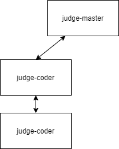

## 判题服务

### 需求

- 多类型题判题
- 多语言判程序
- 多判题机

### 功能

- [ ] 获取题库
- [ ] 添加题库
- [ ] 删除题库
- [ ] 更改题库
- [ ] 判题
- [ ] 判题机状态查询

### 设计



#### 组件

**judge-master**

负责对外提供 API、调度判题模块

**judge-coder**

> 此模块是对青岛大学 OJ 的判题模块封装

负责对程序题进行判断

**judge-normal**

负责对普通（单选、多选、填空、问答）的题型判断

#### API

##### judge-master

###### POST /api/judgeCoder 判程序题

**请求**

```js
{
    "code": String, // 代码
    "lang": LangType, // 语言类型
}
```

```js
LangType{
    c:"c",
    cpp:"cpp",
    java:"java",
    py2:"py2",
   	py3:"py3"
}
```

**响应**

```js

```

